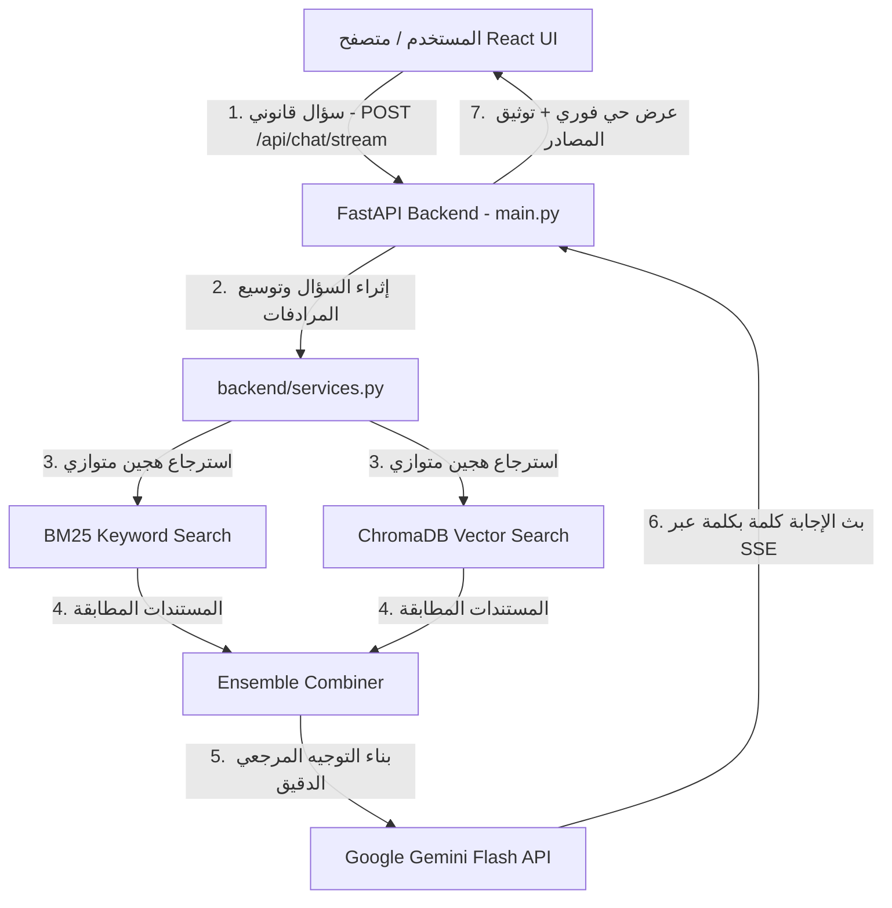

# ⚖️ المعلّم الذكي – القانون المدني اليمني
**(Yemeni Civil Law AI Tutor - Modern React + FastAPI + Hybrid RAG Architecture)**

مشروع ذكاء اصطناعي تفاعلي متقدم مصمم لشرح وتوضيح مواد **القانون المدني اليمني (القرار الجمهوري رقم 14 لسنة 2002م)**.  
يعتمد النظام على معمارية **التوليد المعزز بالاسترجاع الهجين (Hybrid RAG: ChromaDB + BM25)** مع واجهة أمامية حديثة بـ **React + Vite** وخادم خلفي سريع بـ **FastAPI** وبث حي للإجابات عبر **Server-Sent Events (SSE)**.

---

## 🗺️ خريطة المشروع الشاملة (Project Structure & Developer Roadmap)

تم تنظيف وترتيب هيكلية المشروع وفق أفضل الممارسات المعمارية الحديثة (Clean Architecture) ليكون واضحاً لأي مطور من أين يبدأ وكيف يعمل النظام:

```
yemeni-law-tutor/
├── 📁 backend/                # خادم الـ API (FastAPI) ومنطق الاسترجاع والذكاء الاصطناعي
│   ├── main.py                # نقطة دخول الخادم، تعريف المسارات (Endpoints)، CORS، و Rate Limiter
│   ├── services.py            # قلب النظام: محرك البحث الهجين (BM25 + ChromaDB)، البث الحي SSE، وإدارة الذاكرة
│   └── models.py              # نماذج البيانات (Pydantic Models) الخاصة بالطلبات والاستجابات
│
├── 📁 frontend/               # واجهة المستخدم الحديثة (React 19 + TypeScript + Vite)
│   ├── index.html             # صفحة الويب الرئيسية
│   ├── package.json           # مكتبات واعتمادات الواجهة الأمامية
│   └── src/
│       ├── App.tsx            # المكون الرئيسي للواجهة وإدارة حالة المحادثة والبث الحي
│       ├── index.css          # نظام التصميم الفاخر (2026 Digital Diwan Design System)
│       ├── types.ts           # تعريفات الأنواع (TypeScript Interfaces)
│       ├── services/api.ts    # طبقة الاتصال بالخادم الخلفي (REST + SSE Streaming)
│       └── components/        # مكونات الواجهة (TopBar, Sidebar, HeroBanner, ChatInput, ...)
│
├── 📁 config/                 # مجلد الإعدادات المركزية للمشروع (Single Source of Truth)
│   ├── settings.py            # إعدادات النماذج (Gemini Flash, Embedding MiniLM, Retriever K, ...)
│   ├── system_prompts.py      # التوجيه الأساسي (System Prompt) للمعلّم الذكي ومبادئ Zero Hallucination
│   ├── legal_synonyms.py      # قاموس المرادفات القانونية لتوسيع الاستعلامات (Query Expansion)
│   └── api_keys.json          # قائمة مفاتيح Google Gemini API مع التناوب التلقائي
│
├── 📁 utils/                  # الأدوات المساعدة ومعالجة البيانات والنصوص القانونية
│   ├── api_manager.py         # مدير المفاتيح (Rotation, Rate Limit Cooldown, API Key Validation)
│   ├── legal_splitter.py      # مقسّم القانون المدني إلى مواد قانونية محكمة مع بياناتها الوصفية
│   ├── clean_source.py        # تنظيف وتوحيد الفواصل والنصوص الرسمية للقانون
│   └── ingestion.py           # سكريبت بناء وتحديث قاعدة البيانات المتجهة من النص الرسمي
│
├── 📁 data/                   # النصوص القانونية المعتمدة
│   └── yemeni_civil_law_official.txt  # النص الرسمي الكامل للقانون المدني اليمني (2002م)
│
├── 📁 chroma_db_v2/           # قاعدة البيانات المتجهة المحلية (ChromaDB Vector Store)
├── run_web.bat                # سكريبت التشغيل بضغطة زر (يبدأ خادم FastAPI وواجهة React معاً)
├── requirements.txt           # متطلبات بايثون للبيئة الافتراضية
└── README.md                  # هذا الدليل الشامل
```

---

## 👨‍💻 من أين يبدأ المطور؟ (Where to Start Developing)

إذا كنت مطوراً وتريد تعديل أو تطوير جزء معين في المشروع، إليك دليلك المباشر:

### 1. لتعديل واجهة المستخدم (UI / Frontend):
- **المكان:** مجلد `frontend/src/`
- **الشكل والتصميم والألوان:** قم بتعديل ملف [frontend/src/index.css](file:///c:/Users/hp/Desktop/yemeni-law-tutor/frontend/src/index.css).
- **منطق المحادثة والبث الحي:** تجده في [frontend/src/App.tsx](file:///c:/Users/hp/Desktop/yemeni-law-tutor/frontend/src/App.tsx).
- **المكونات (الأزرار، البار العلوي، بطاقات الاقتراحات):** تجدها داخل مجلد [frontend/src/components/](file:///c:/Users/hp/Desktop/yemeni-law-tutor/frontend/src/components).
- **ربط الـ API:** في ملف [frontend/src/services/api.ts](file:///c:/Users/hp/Desktop/yemeni-law-tutor/frontend/src/services/api.ts).

---

### 2. لتطوير أو إضافة مسارات في الخادم (Backend Endpoints):
- **المكان:** مجلد `backend/`
- **إضافة Endpoint جديد أو تعديل الـ CORS و Rate Limit:** يتم في [backend/main.py](file:///c:/Users/hp/Desktop/yemeni-law-tutor/backend/main.py).
- **تعديل نماذج البيانات المستقبلة أو المرسلة:** في ملف [backend/models.py](file:///c:/Users/hp/Desktop/yemeni-law-tutor/backend/models.py).

---

### 3. لتعديل ذكاء النظام أو البحث القانوني (AI / RAG / Prompt):
- **المكان:** مجلدي `backend/` و `config/`
- **تغيير أسلوب إجابة الذكاء الاصطناعي (System Prompt):** قم بتعديل [config/system_prompts.py](file:///c:/Users/hp/Desktop/yemeni-law-tutor/config/system_prompts.py).
- **تغيير نموذج Gemini أو نموذج التضمين المحلي:** قم بتعديل [config/settings.py](file:///c:/Users/hp/Desktop/yemeni-law-tutor/config/settings.py).
- **تعديل محرك البحث الهجين (BM25 + Vector Search) أو منطق SSE Streaming:** يقع بالكامل داخل [backend/services.py](file:///c:/Users/hp/Desktop/yemeni-law-tutor/backend/services.py).
- **إضافة مرادفات قانونية جديدة:** في ملف [config/legal_synonyms.py](file:///c:/Users/hp/Desktop/yemeni-law-tutor/config/legal_synonyms.py).

---

### 4. لتحديث نصوص القانون أو إعادة بناء قاعدة البيانات المتجهة (Data & Ingestion):
- **المكان:** مجلدي `data/` و `utils/`
- **تحديث نص القانون:** قم بتحرير النص الرسمي في [data/yemeni_civil_law_official.txt](file:///c:/Users/hp/Desktop/yemeni-law-tutor/data/yemeni_civil_law_official.txt).
- **لإعادة بناء فهرس ChromaDB بعد التعديل:** قم بتشغيل الأمر:
  ```powershell
  .\venv\Scripts\python.exe utils/ingestion.py
  ```

---

## ⚡ خريطة تدفق البيانات (How it Works - Request Flow)



---

## 🚀 دليل التشغيل السريع (Quick Start)

### الطريقة الأولى: التشغيل الفوري بضغطة زر (الموصى بها)
قم بتشغيل ملف السكريبت المرفق:
```powershell
.\run_web.bat
```
سيقوم السكريبت تلقائياً بـ:
1. تشغيل خادم **FastAPI** على المنفذ `8000`.
2. تشغيل واجهة **React + Vite** على المنفذ `5173`.

- **رابط تطبيق الويب (الواجهة):** [http://localhost:5173](http://localhost:5173)
- **رابط توثيق الـ API (Swagger):** [http://localhost:8000/docs](http://localhost:8000/docs)

---

### الطريقة الثانية: التشغيل اليدوي المنفصل (للمطورين أثناء التطوير)

#### 1. تشغيل خادم الـ API (FastAPI):
```powershell
# في نافذة PowerShell الأولى
.\venv\Scripts\activate
uvicorn backend.main:app --host 0.0.0.0 --port 8000 --reload
```

#### 2. تشغيل واجهة المستخدم (React Vite):
```powershell
# في نافذة PowerShell الثانية
cd frontend
npm run dev -- --host
```

---

## 🛡️ مميزات البنية المعمارية الحالية

- **مقاومة للهلوسة (0% Hallucination):** اعتماد كامل على تقنية RAG الهجينة (BM25 + Semantic Vector Embeddings) مقيدة بحرفية مواد القرار الجمهوري رقم 14 لسنة 2002م.
- **التدوير الاستباقي للمفاتيح (Proactive API Key Rotation):** نظام ذكي في `utils/api_manager.py` يراقب استهلاك المفاتيح ويتنقل بينها تلقائياً قبل حدوث خطأ `429 Rate Limit`.
- **سرعة استجابة فائقة (< 0.3 ثانية):** بفضل التخزين المؤقت الذكي في الذاكرة (`In-Memory Response Cache`) والتطبيق المتوازي للاسترجاع عبر `ThreadPoolExecutor`.
